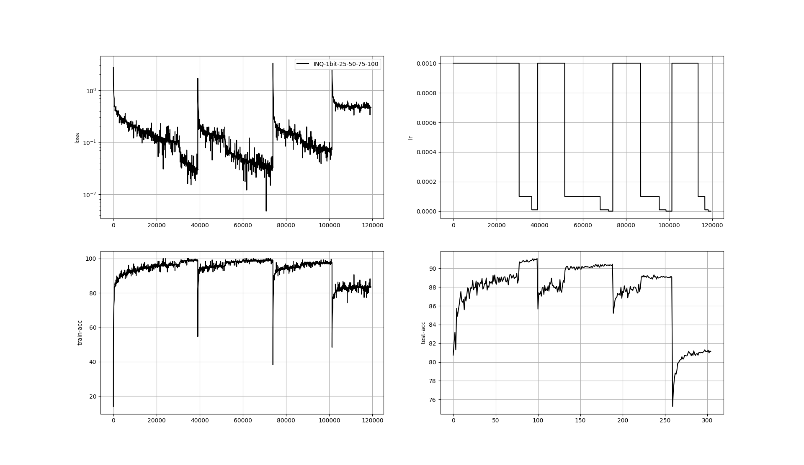

# My Re-implementation of Incremental Network Quantization
Under Improvement

## How to use it

### Specify your Dataset Root
Please refer to [here](../../Codes)

### Train a full-precision model

Please refer to [here](../TTQ#train-a-full-precision-model)

### Put utils in

```
ln -s ../utils ./utils
```

### Run the Codes

```
python INQ.py -m ResNet20 -d CIFAR10 -bw 1 -q 25 50 75 100
```

## Experiment
| Model    | Dataset |  bitW | Quantization Procedure | Quantized Acc | FP Acc |
| :-------:|:-------:|:-------:|:-------:|:-------------:|:--------:|
| ResNet20 | CIFAR10 | 1 | 25->50->75->100 | 81.31 | 91.5|

### Visualization

Training log of INQ in ResNet20 CIFAR10 with quantization procedure as 25->50->75->100:

