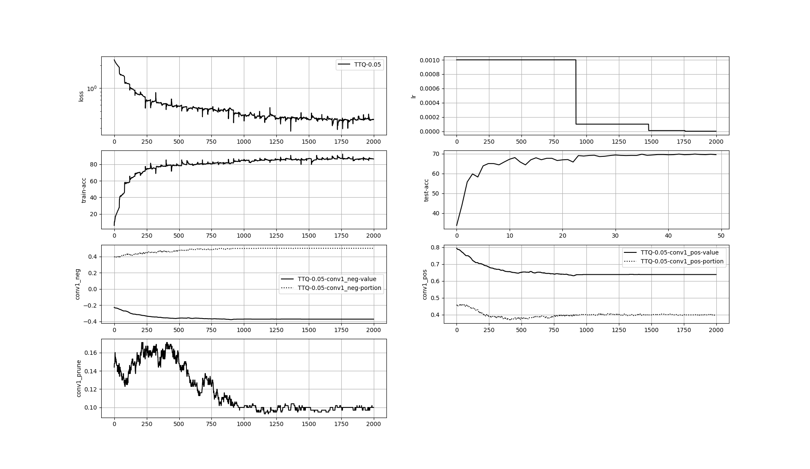

# My Re-implementation of Trained Ternary Quantization

## How to use it

### Specify your Dataset Root
Please refer to [here](./README.md)

### Train a full-precision model

Run `train_base_model.py` by specifying your model architecture and dataset used. Such as:

```
python train_base_model.py -m ResNet20 -d CIFAR10
```
By using `train_base_model.py`, it will generate a folder named as `../Results/model-dataset` (such as 
`../Results/ResNet20-CIFAR10`) in the upper level folder, with the pretrain network named as `model-dataset-pretrained.pth`

### Put utils in

```
ln -s ../utils ./utils
```

### Run the Codes

```
python TTQ.py -m ResNet20 -d CIFAR10 -tf 0.05
```

### Results Visualization
Specify the training log path you want to see in `visualize_training_log.py`
```
python visualize_training_log.py
```

## Experiment
All layers are ternarized:

| Model    | Dataset |  Quantized Acc | FP Acc |
| :-------:|:-------:|:-------------:|:--------:|
| ResNet20 | CIFAR10 | 90.3| 91.5|
| ResNet20 | STL10 | 69.825 | 70.3 |

### Training Log of ResNet20-STL10
 

## Customization
Build your own model with `nn.Conv2d`/`nn.Linear` replaced by `TTQ_CNN`/`TTQ_Linear`.

## Acknowledgement
This reimplementation is based on [Trained Ternary Quantization](https://arxiv.org/pdf/1612.01064v1.pdf).