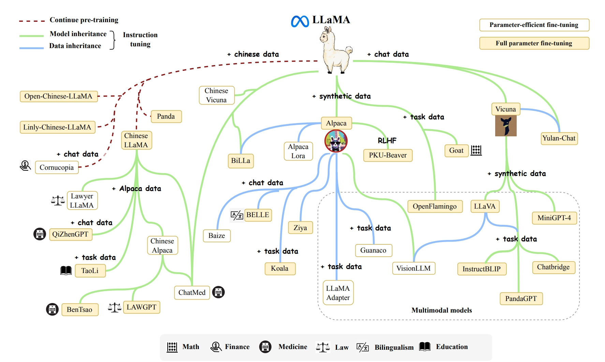

# Overall

## [Quantization](../../Paper/Large-Pretraining-Models/Quantization.md)

## Compression
- COMCAT: Towards Efficient Compression and Customization of Attention-Based Vision Models
- Token Merging: Your VIT but Faster

## Distillation
- Less is More: Task-aware Layer-wise Distillation for Language Model Compression

## System
- Megatron-LM: Training Multi-Billion Parameter Language Models Using Model Parallelism
- DeepSpeed Inference: Enabling Efficient Inference of Transformer Models at Unprecedented Scale

## Finetune
- Fine-Tuning Language Models with Just Forward Passes

## Survey
- [A Survey of Large Language Models](http://arxiv.org/abs/2303.18223)

## LLM Family
### GPT
### Llama
  
  - [Alpaca](https://crfm.stanford.edu/2023/03/13/alpaca.html)
  - [Koala](https://bair.berkeley.edu/blog/2023/04/03/koala/)
  - [Baize](https://arxiv.org/pdf/2304.01196.pdf)
  - [Vicuna](https://arxiv.org/abs/2306.05685)
    - RedPajama
    - Falcon
  - [Llama-2]()

### [GLM](https://github.com/THUDM/GLM)
- [ChatGLM](https://github.com/THUDM/ChatGLM-6B)
- [VisualGLM](https://github.com/THUDM/VisualGLM-6B)
    
### [RWKV](https://arxiv.org/abs/2305.13048)

- [WizardLM](https://github.com/nlpxucan/WizardLM)
- [MPT](https://www.mosaicml.com/blog/mpt-30b)

